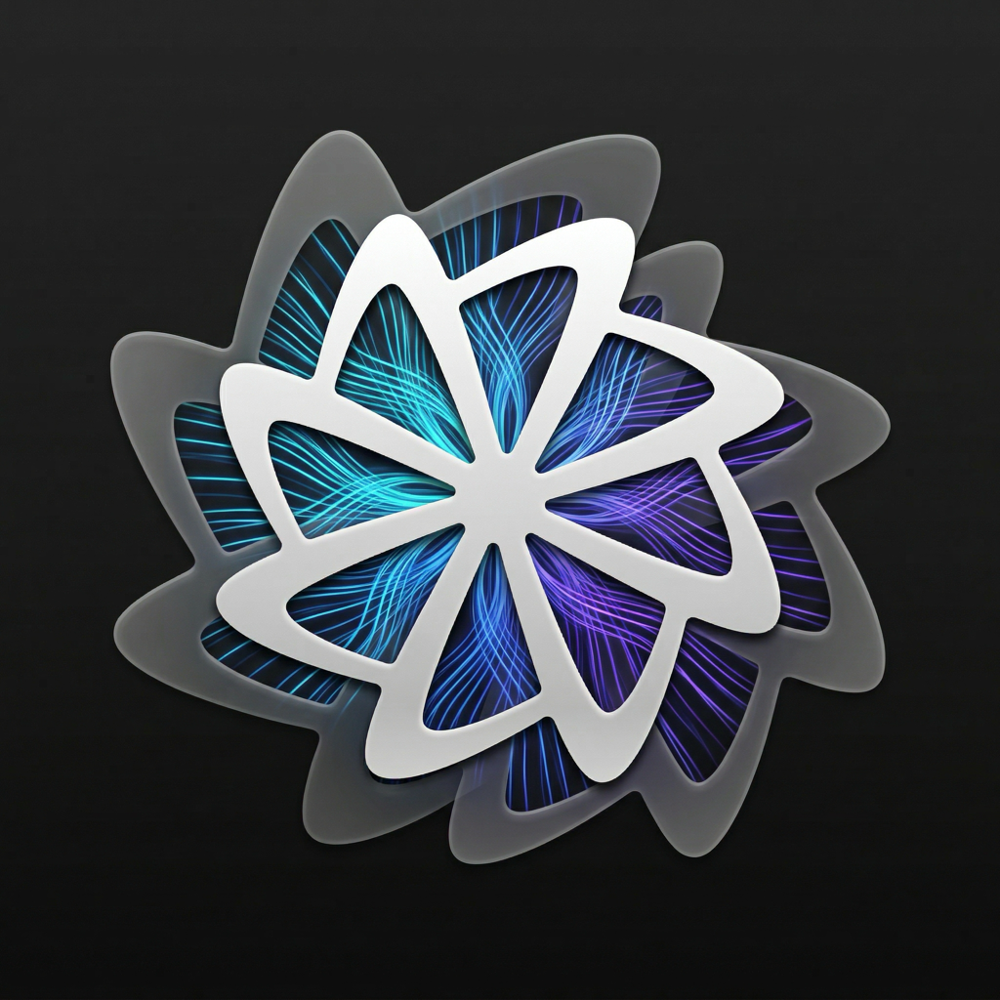
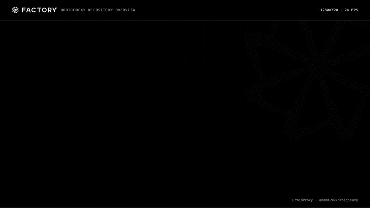
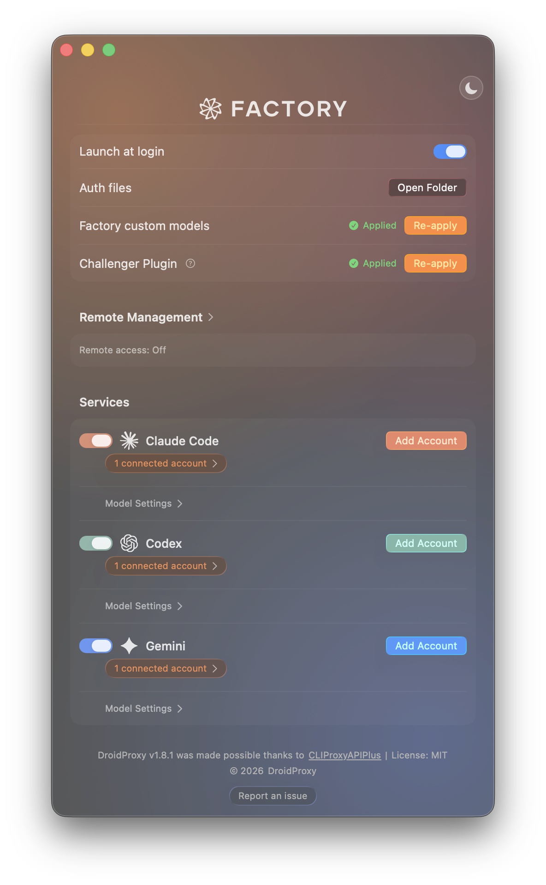

# DroidProxy for Omarchy

<p align="center">
  
</p>

<p align="center">
  <strong>Your Claude, Codex, Gemini, Grok, and Meta Muse subscriptions — on Omarchy, for <a href="https://app.factory.ai"></a> Droids.</strong>
</p>

A native Linux port of [DroidProxy](https://github.com/anand-92/droidproxy) for [Omarchy](https://omarchy.org). Background service, Omarchy bar icon, settings panel. Built on [CLIProxyAPI](https://github.com/router-for-me/CLIProxyAPI).

<p align="center">
  
</p>

## Install

One command. No `sudo`.

```bash
curl -fsSL https://raw.githubusercontent.com/nikships/droidproxy-omarchy/main/install.sh | bash
```

That downloads the latest release for your CPU (x86_64 or arm64), verifies the SHA-256 checksum and ed25519 signature, installs into `~/.local/share/droidproxy`, puts `droidproxy` on your `PATH`, enables the systemd user service, and adds the Omarchy bar plugin plus a launcher entry.

### Updates

Checks GitHub Releases once a day (Sparkle-style). Desktop notification with an **Install** button when something new is out; Settings → Updates can auto-install. Or from a terminal:

```bash
droidproxy update check
droidproxy update install
droidproxy rollback
```

### Uninstall

```bash
droidproxy uninstall          # keeps your accounts and settings
droidproxy uninstall --purge  # also removes DroidProxy's settings
```

## Features

- **One-click OAuth auth** -- Claude Code, Codex, and Antigravity login from the Settings panel, with credential monitoring and automatic OAuth token refresh. Multiple accounts per provider, with per-account enable/disable.
- **Grok and Meta Muse** -- Device-code sign-in for SuperGrok / X Premium+ (Grok 4.7 and Grok 4.7 Fast) and Meta Muse (Muse Spark 1.3, with Contributor mode).
- **Every model, every reasoning level** -- Fable 5.1, Opus 5.5, Sonnet 4.6, GPT 6 Astra, GPT 6 Sol, GPT 6 Luna, Gemini 3.1 Pro, Gemini 3 Flash, and more — registered as Factory custom models with their full set of native reasoning levels. Pick the effort per session in Droid's model selector.
- **Fast Mode** -- Optional `service_tier=priority` for GPT 6 Astra, GPT 6 Sol, and GPT 6 Luna. Grok 4.7 Fast is a separate SuperGrok model (`grok-4.7-build-fast`).
- **Account failover** -- Round-robin by default, or sequential failover that rides one account until its quota runs out.
- **Usage tracking** -- Claude and Codex OAuth quota windows (5-hour + weekly) in the Settings panel.
- **Grok Imagine and GPT Image** -- OpenAI-compatible image generation through your Grok or Codex subscription. See [Image generation skills](#image-generation-skills).
- **Remote access** -- Optional remote management with a secret key, and a configurable bind address (beta).

<p align="center">
  
</p>

## Using it

- **Bar icon** -- click for the quick menu (server status, start/stop, copy the server URL, open the CLIProxyAPI dashboard, check for updates, quit).
- **Settings** -- quick menu → **Open Settings**, the launcher entry, or `droidproxy open`.
- **Factory models** -- Settings → **Factory custom models → Apply** writes DroidProxy's models into `~/.factory/settings.json` (timestamped backup first). In Droid, use `/model` and search for "DroidProxy:".

See [SETUP.md](SETUP.md) for provider details and manual Factory configuration. **(OR use the 1-click options in the UI!)**

### Command line

```
droidproxy status              show server and provider status
droidproxy start|stop|restart  control the proxy servers
droidproxy open                open the Settings panel
droidproxy login <provider>    add an account (claude, codex, antigravity, grok, meta)
droidproxy update [check|install]
droidproxy rollback            go back to the previously installed version
droidproxy logs                follow the service log (journalctl)
droidproxy version
```

## How it works

```
Droid ──► :8317 ThinkingProxy ──► :8318 CLIProxyAPI ──► provider
                    └──► api.x.ai / cli-chat-proxy.grok.com / api.meta.ai (Grok, Muse Responses)
```

- `droidproxy serve` runs as a systemd user service. ThinkingProxy on `localhost:8317`, bundled CLIProxyAPI on `127.0.0.1:8318`.
- The Omarchy shell plugin talks to the service over a private Unix socket (`$XDG_RUNTIME_DIR/droidproxy/control.sock`). See [docs/control-api.md](docs/control-api.md).
- Service logs: `journalctl --user -u droidproxy`. Per-request reasoning log: `~/.local/state/droidproxy/droidproxy-debug.log`.

## Image generation skills

If you have **Grok** and/or **Codex** connected, you can generate images through the same proxy:

```bash
mkdir -p ~/.factory/skills
cp -R skills/grok-imagine ~/.factory/skills/
cp -R skills/gpt-image ~/.factory/skills/
```

Both skills post to `http://localhost:8317/v1/images/generations` with `Authorization: Bearer dummy-not-used`:

- **Grok** -- model `grok-imagine-image-2.0`. ThinkingProxy injects your Grok OAuth token and forwards to xAI.
- **GPT** -- model `gpt-image-2.5-flare` (fast default) or `gpt-image-2.5-sunburst` (maximum quality). CLIProxyAPI injects your Codex OAuth token. Requires ChatGPT Plus/Pro.

## Requirements

- Omarchy (Arch Linux + Hyprland + omarchy-shell), x86_64 or arm64 (including Asahi Linux)
- `curl` and `tar` for the installer (ship with Omarchy)

## Build from source

```bash
go test ./...
scripts/dev.sh                          # build into build/dev and run the daemon in the foreground
scripts/build-release.sh 1.2.3 arm64    # build a release tarball into dist/
```

## Releases

Every push to `main` (except documentation-only changes) runs the tests, bumps the patch version, builds x86_64 and arm64 tarballs, signs them, and publishes a GitHub Release. Installed copies pick it up through the updater. A scheduled workflow opens a pull request whenever a new CLIProxyAPI version comes out.

## License

MIT
